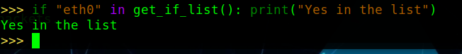

# Packet Analyzer

This repository contains a simple packet analyzer and two PoC python script

## Installing 

###### 1 clone the repo on the sniffer vm

```bash
git clone https://github.com/LightFoe/SimplePacketAnalyzer.git
```

###### 2 install the requirements.txt on the sniffer vm

```bash
pip install -r requirements.txt
```

###### 3 move the two PoC (Proof of Concept) attacks scripts(portscanSS.py and synattack.py) to the attacker vm and install the requirements.txt on that too

###### 4 run the detetctattack.py script on the sniffer vm and choose an attack on the attacker vm and run it.

Note that if both attacks are performed port-scan will have priority due to its nature. Syn-flood attacks are usually an end unto themself instead port scanning usually herald something bigger.

### detectattack.py

This script will analyze network traffic in the network to detect any syn-flood attack and port scanning attacks.


> Usage : python3 detectattack.py iface

If iface is not correct it'll run with the default settings, sniffing on all interfaces.
To check if the iface in input is the correct one there is a scapy function.




### attack scripts

Head to the attacker vm and edit with vim or nano the scripts to change the two ip's placeholder to what Ip's you have on your machine

##### synfattack.py

This script is a PoC of a syn-flood attack. A syn-flood attack will try to make a server unavailable by "chocking" with lots of syn the server which will respond with a SYN-ACK allocating some resource to it. If the Ip is not spoofed (it syn attack it usually is), the client needs to have lots of resources(more than the server is trying to flood) not to flood himself with all the SYN-ACK.

> Usage : python3 synfattack.py

##### portscanSS.py

This script is a PoC of a tcp syn scan just to demonstrate that a tcp syn scan will be detected. If is required a more accurate portscan and you are on linux you can run nmap $ip (with or without -sS flag ). This script will emulate that behaviour not caring to return any info.

> Usage : python3 portscanSS.py


